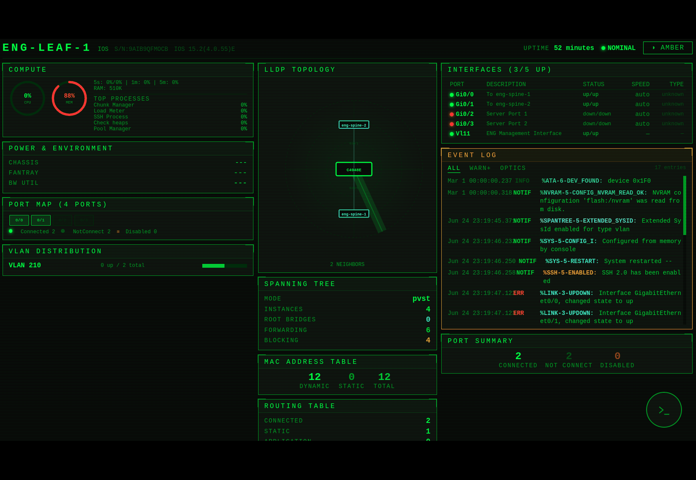
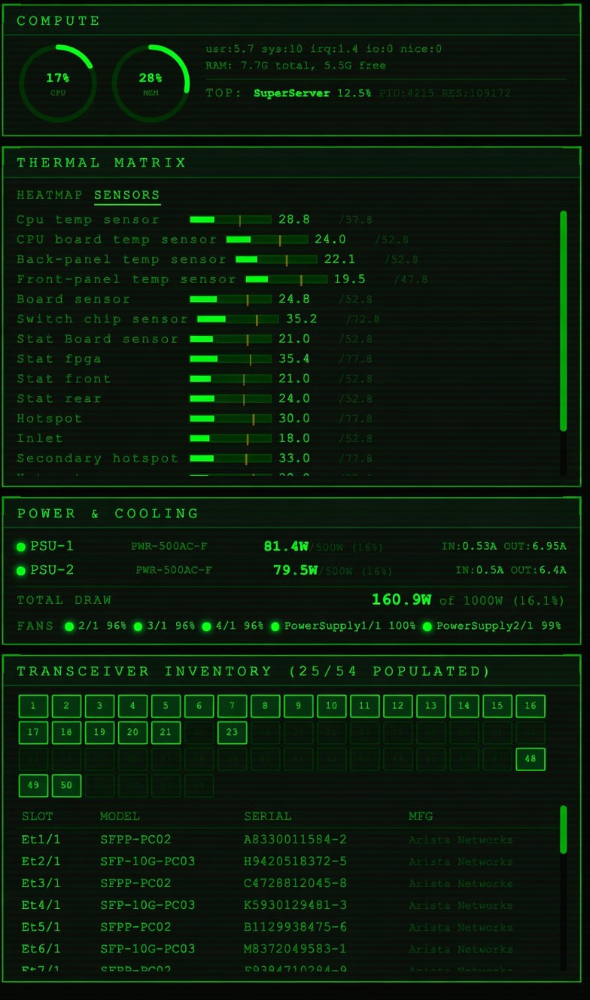
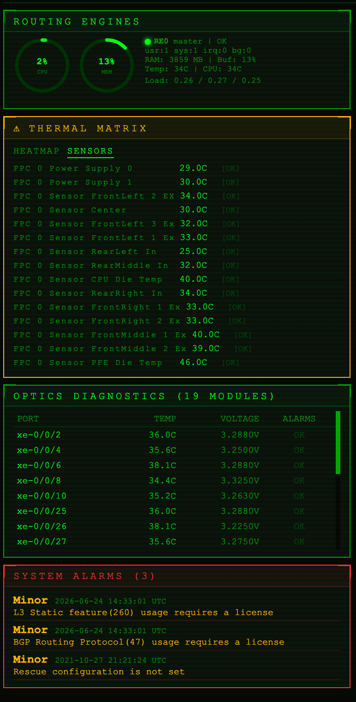
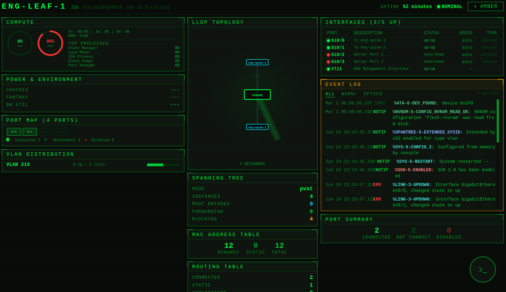
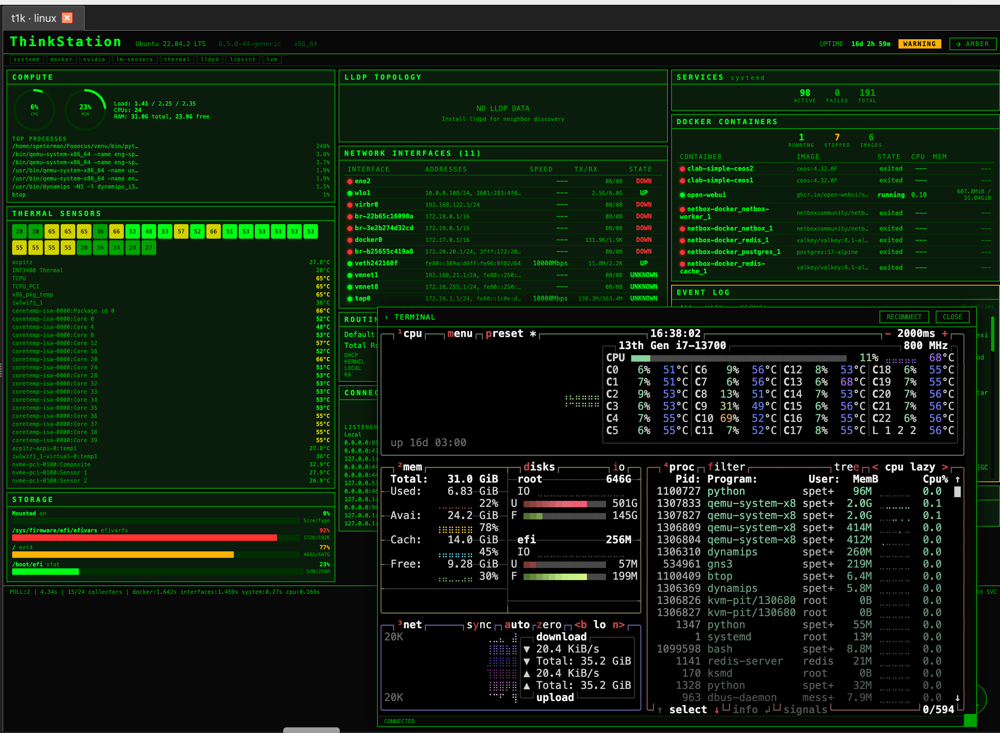
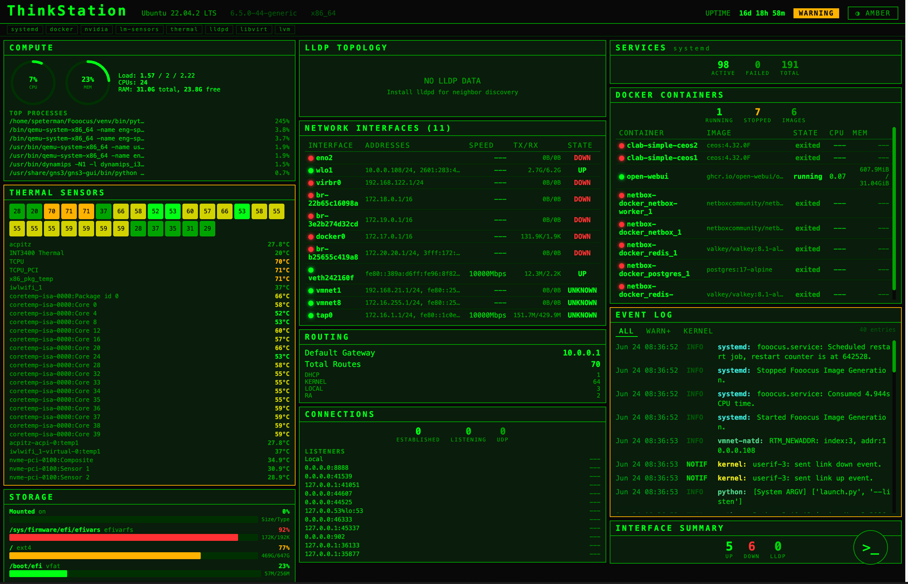

# nethuds desktop (nhd) — proof of concept

<p align="center">
  
</p>

A triage cockpit for network devices. Log into a box you've never seen — with
nothing but an IP and credentials — and `nhd` renders that device's live health
as a single HUD: routing engines, BGP, thermals, optics, interfaces, OSPF
adjacencies, the event log, all read at a glance and the *same method - SSH* across
Arista, Juniper, Cisco IOS, and Linux.

The point is that it assumes **no prior instrumentation**. The device doesn't
have to be in an inventory, streaming telemetry, or wired into a dashboard
someone built ahead of time — the only prerequisite is SSH access. That's the
one moment every poll-and-store tool has already missed: the cold open on an
unfamiliar box, mid-incident, when you have no baseline in your head and a
terminal would make you interrogate the device one `show` command at a time. The
HUD orients you instead — and because each reading carries its own reference
frame (35.4°C against a 77.8 ceiling, 51 peers / 0 down), a value means
something even on a box you've never met.

Around that core it adds the chrome a server-only HUD lacks: an **editable,
filterable** session tree, an encrypted credential vault with a full management
UI, key-based SSH auth, zoomable tabbed multi-device views, a dark UI, and window
state that persists across restarts — all without rewriting the
[nethuds](https://pypi.org/project/nethuds/) HUD pages.

<table>
  <tr>
    <td width="50%"></td>
    <td width="50%"></td>
  </tr>
  <tr>
    <td align="center"><em>Arista EOS — compute, thermal matrix, power &amp; cooling, transceiver inventory</em></td>
    <td align="center"><em>Juniper Junos — routing engines, FPC sensors, optics diagnostics, system alarms</em></td>
  </tr>
</table>

Different gear, the *same reading frame*: every value carries its own reference
(35.4 °C against a 77.8 ceiling, 51 peers / 0 down), so a number means something
on a box you've never met.

## What this is

nethuds ships each vendor dashboard as its own FastAPI server that serves a
self-contained HTML/JS HUD and proxies a live SSH session. That is excellent
for one device in a browser tab, but it is server-only: there is no session
manager, no credential store, and no desktop chrome.

`nhd` wraps those servers in a PyQt6 application. It loads a session file
(terminal-telemetry format, or a nethuds `devices.yaml`), shows the devices in
a grouped tree you can edit in place, and opens each one in its own tab backed
by a `QWebEngineView`. Authentication is resolved from an encrypted vault (or
prompted for at connect time) and the wrapper establishes the SSH session
itself, so a private key never has to ride a URL.

It is still a proof of concept — the roadmap below lists what is deliberately
unfinished — but the three things that made the original POC a "file viewer"
rather than a tool are now done: **CRUD session editing with persistence, an
encrypted credential vault, and key-capable auth wired into the login path.**

<p align="center">
  
  <br>
  <em>A Cisco IOS leaf on a cold open — LLDP topology, spanning tree, MAC and
  routing tables, interfaces and the live event log, all from one SSH session.</em>
</p>

## How it works

Three observations make the HUD-hosting an "easy path" rather than a rewrite:

**The servers run in-process — mostly.** Rather than spawning subprocesses for
everything (what nethuds' own CLI launcher does), the wrapper imports each
vendor's FastAPI `app` and runs it on a background thread via uvicorn, bound to
`127.0.0.1` only. That gives direct control of the bound port, keeps no listener
exposed off-box on a laptop that holds SSH credentials, and ties every server's
lifecycle to the window. Servers start lazily — a vendor only spins up when its
first tab opens. The one exception is Linux, which runs as a **subprocess per
tab** (see Process model below); the session vendors share one thread server
each.

**The HUD pages are origin-relative.** Each page derives its WebSocket target
from `location.host`, so it reconnects to whatever port the wrapper bound. The
chosen port never has to be threaded into the JavaScript — serving the page from
that port is enough. If the preferred vendor port is taken, the wrapper walks
forward to the next free one.

<p align="center">
  
  <br>
  <em>The wrapper-established session, attached: the Linux HUD with a live
  terminal (here <code>btop</code>) running over the very SSH connection the HUD reads.</em>
</p>

**Connection: the wrapper establishes, the page attaches.** This is the part
that changed from the original POC. Each HUD's `/api/connect` accepts a key's
*contents* (`key_text`) but the login modal can only forward a key from a file
`<input>`, never a path or stored secret — so a key cannot travel through the
page. Instead, for any session with a resolved identity (vault credential,
inline key, or a connect-time prompt), the wrapper POSTs `/api/connect` itself
over loopback with the key/password and `legacy_ssh`, gets back a `session_id`,
and loads the page pointed at that session so it **attaches** rather than
reconnecting. The decrypted secret lives only in that loopback POST body — never
in the URL, the page's JavaScript, or sessionStorage.

  * **Session vendors (Arista/Juniper/Cisco)** return a `session_id`; the page
    is loaded as `/?session=<id>&name=…` and its resume path
    (`/api/status?session=…`) attaches. This needed a ~5-line addition to each
    of the three pages so they read `?session=` from the URL into `_sessionId`
    (see Front-end patch below).
  * **Linux** is single-target, returns no id, and needs no page change: the
    wrapper establishes its one device and loads the page bare (`/?name=…`),
    whose existing no-params branch attaches telemetry to the live collector.

The blocking SSH handshake runs off the UI thread in a `ConnectWorker`, and a
bad login surfaces as the tab's error splash because the wrapper sees the
server's `status: error` response (see Authentication below).

> The **vendor-default** path still uses the page's original
> `?host=…&autoconnect=true` mechanism, where the page authenticates from the
> server's own vendor yaml. It is now an explicit, opt-in mode rather than a
> silent fallback, because it is the one path the wrapper can't validate (it
> doesn't hold the yaml's secret).

### Process model: shared vs dedicated

<p align="center">
  
  <br>
  <em>The full Linux cockpit — systemd services, Docker, network interfaces,
  routing and thermals from one SSH login. Each Linux tab runs as its own
  subprocess (below).</em>
</p>

`ServerManager` runs two kinds of server:

- **Shared (Arista, Juniper, Cisco)** — one in-process thread server per vendor,
  reused by every tab. These servers isolate devices by `session_id`, so many
  tabs to many devices coexist on one server. Kept warm until the app exits.
- **Dedicated (Linux)** — a fresh **subprocess** per tab. The Linux server is
  single-target: `CONFIG["device"]`, the collector, and the poll task are
  module-level globals, so two tabs in one process would collide. A separate OS
  process gives each Linux tab its own globals and loop. `release()` terminates
  the subprocess when its tab closes; `stop_all()` (also wired to `atexit`)
  reaps any survivors.

A Linux tab therefore costs one Python process (~60–80 MB) and a ~1–2 s cold
start while the child imports and binds.

## Authentication & the credential vault

Authentication is no longer a single plaintext identity per vendor yaml. Each
session declares **how** it authenticates via its `credential` field, resolved
on the UI thread before any server is touched:

| `credential` value | behaviour |
|--------------------|-----------|
| a vault name       | use that stored credential (vault must be unlocked) |
| `@prompt`          | always ask for username + password/key at connect; nothing stored |
| `""` (none)        | a matching/default vault credential if the vault is unlocked, else an inline secret, else prompt |
| `@vendor`          | the HUD server authenticates from its own vendor yaml (the only in-page auth path) |

The important property: a session with nothing to authenticate with **prompts**
rather than silently failing. Connect-time prompts and stored credentials both
go through the wrapper-establishes path, so a wrong password/key shows as the
tab's red error splash instead of a dead HUD.

### The vault (`nhd/vault.py`)

A direct descendant of the [nterm-qt](https://github.com/scottpeterman/nterm-qt)
vault: SQLite for storage, Fernet for encryption, a master password stretched
with PBKDF2-HMAC-SHA256 (480k iterations) and a verify-token unlock check.
Credentials store a key's *contents* (not a path), which is exactly what
`/api/connect` consumes. `cryptography` is already in the dependency tree
(paramiko depends on it), so the vault adds no new dependency. The vault lives
at `~/.nhd/vault.db`.

`CredentialResolver` matches a device to a credential — a pinned name wins
outright; otherwise the most-specific host glob beats a tag match beats the
`is_default` catch-all — and emits a `ResolvedIdentity` carrying just the
`/api/connect` identity subset (username + password XOR key_text, `use_keys`,
`legacy_ssh`).

`legacy_ssh` is deliberately **not** stored on the credential — it is a property
of the device (does this box speak only old KEX/host-key algorithms), so it
lives on the session and is supplied at resolve time. The IOSv-era gear needs it.

### Managing credentials — the vault manager

**Vault → Manage credentials…** opens the manager dialog that retires the CLI
for day-to-day use. It lists every credential (name, username, auth type, host
globs, tags, default) and offers add / edit / delete / set-default — plus the
two edits `vaultctl` has no path for: **rename** and **username change** in
place. **Change master…** re-keys the vault, re-encrypting every secret under a
new master password (the GUI equivalent of `rekey`).

The manager is honest about the vault's lock state, because the store is. The
metadata listing, delete, and set-default all work while the vault is *locked*
— they touch no ciphertext — so the dialog opens and stays useful before an
unlock, with an inline banner offering to unlock. Add and edit decrypt and
re-encrypt secrets, so they stay disabled until the vault is unlocked, behind
the same gate the connect path uses. Editing a credential pre-fills its
decrypted secrets (only reachable unlocked), so what you see is what gets
stored: clear the password or key field and that secret is removed. A credential
must keep at least one secret — the invariant `vaultctl add` already enforces —
and a passphrase-looking key draws the same non-blocking warning, since the HUD
server can't forward a passphrase to paramiko. The editor reads a key's
*contents* from a file (never a path), matching what the vault stores and what
`/api/connect` consumes.

### Managing credentials from the CLI — `nhd.vaultctl`

The scriptable front door to the vault, for headless setup and automation. The
manager above covers the same ground interactively (and adds rename / username
change), so the CLI is no longer the only way in:

```bash
python -m nhd.vaultctl init
python -m nhd.vaultctl add lab --user admin \
      --key-file ~/.ssh/lab_ed25519 --hosts '172.16.*,10.0.0.*' --default
python -m nhd.vaultctl add netops --user oxidize --password --hosts '10.7.*'
python -m nhd.vaultctl list                 # NAME is the first column
python -m nhd.vaultctl show lab
python -m nhd.vaultctl set-default lab
python -m nhd.vaultctl remove old-cred
python -m nhd.vaultctl rekey                # change master password
```

`remove`/`show`/`set-default` take the credential **NAME** (the first column of
`list`), not its username. `--hosts`/`--tags` only matter for automatic
resolution; a session that pins a credential by name skips scoring. The master
password is prompted interactively, or read from `$NHD_VAULT_PASSWORD` for
scripting; the db path can be overridden with `--db` or `$NHD_VAULT_DB`.

## Session management

The session tree is editable. Right-click for a context menu:

- on a **session**: Connect · Edit… · Duplicate · Delete · New session… · New folder…
- on a **folder**: New session in folder… · Rename folder… · Delete folder · New folder…
- on **empty space**: New session… · New folder…

**Folders.** A folder is just a session's `group`, so historically a folder
could only exist once something lived in it. **New folder…** creates an empty
one up front — name it, then drop sessions in. An empty folder persists across a
save/reload as `{folder_name: …, sessions: []}`; it stops being "empty" the
moment a session joins it and becomes an ordinary derived group again. (Deleting
a folder's last session still removes the folder; only folders you create
explicitly stick around while empty.)

Double-click still connects. The editor covers name, host, device type
(dropdown → routes to the right HUD), group (editable combo), credential
(dropdown of vault names + the modes above), username, tags, port, and the
legacy-SSH checkbox.

**Filtering.** A filter box sits above the tree. Typing narrows it to matching
sessions, and the match runs against the whole session — name, host, vendor,
device type, group, username, credential, and tags — not just the visible
label, so `arista`, `10.7`, a tag, a credential name, or `@prompt` all work.
Whitespace-separated terms are ANDed (`spine prod` keeps only sessions matching
both) and matching is case-insensitive. Groups with no surviving session are
hidden and groups with a hit auto-expand, so results surface without clicking;
an empty box restores everything and a filter that matches nothing tints the
box. The filter re-applies itself after an edit rebuilds the tree, so it
survives a rename or a new session. **Ctrl+F** focuses the box, **Esc** clears
it.

Edits persist back to the loaded file automatically (Ctrl+S, or File → Save
sessions as… to choose a location), in the same termtels format the loaders
read, so a saved file reloads identically. **Secrets never round-trip** — the
file stores a credential *name*, never a password. The title bar shows a `•`
when there are unsaved changes. A `devices.yaml` is treated as an import (not
the native save format), so it won't be silently rewritten in a different shape.

**File → New session file** (Ctrl/Cmd+N) starts an empty, unsaved set — build it
up with New folder… / New session…, and the first save picks a location, after
which edits auto-persist like any loaded file. Anything that would discard
pending edits — New file, opening another file, or quitting — first offers to
**save / discard / cancel**, so an unsaved set (or an edited `devices.yaml`
import, which has no auto-save target) can't vanish silently on exit.

Editing a session mutates the object in place, so an open tab keeps pointing at
the right session — but a live connection isn't retroactively changed; close and
reconnect to pick up a new host or credential.

**Tabs.** Each device opens in its own closable, movable tab. Right-clicking the
tab bar offers **Close**, **Close Others**, **Close to the Right**, and **Close
All** (right-clicking empty bar space offers just Close All). The bulk closers
run the same teardown as a single close, so a Linux tab's dedicated subprocess
is still reaped when it goes.

**Window state.** Window geometry, the tree/tab splitter position, the HUD zoom
level, the application scale factor, and the path of the last-loaded session
file are remembered between runs via `QSettings` (the platform-native backend —
registry / plist / `.conf`). Launch with no `--session-file`/`--devices` and the
file open at last exit is reopened — a `devices.yaml` is re-imported (never
silently rewritten), and a CLI path always wins over the remembered one. Nothing
stored here is a secret — geometry, a zoom factor, a file *path* — so the vault
stays the only store of credentials.

**High-DPI & scaling.** Two independent knobs, both under **View**:

  * **Zoom** (Ctrl/Cmd +/-/0) is the HUD *page* zoom — Chromium-level, applied
    live to every tab and re-applied across the connect navigation. This is the
    one to reach for moment to moment.
  * **Scale Factor** is the *application* scale (Qt's `QT_SCALE_FACTOR`): Auto
    (detect from the display) or a forced preset. Qt fixes the UI scale when the
    process starts, so a change here is saved to `QSettings` and applies on the
    **next launch**, not live — the menu says as much when you pick one. It's the
    fix for a display whose auto-detected scaling is wrong, and it scales the
    chrome *and* the web views together. `--scale FACTOR` does the same from the
    CLI (and persists it); `--scale 0` clears the override back to Auto.

Qt6 enables high-DPI scaling by default (the Qt5 `AA_EnableHighDpiScaling` /
`AA_UseHighDpiPixmaps` attributes are no-ops now), and the wrapper sets the
scale-factor rounding policy to `PassThrough` so fractional display scales
(125 % / 150 % / 175 % on Windows & Linux 4K panels) stay crisp instead of
rounding to the nearest integer. On macOS Retina (integer 2×) none of this is
needed; it's there for the mixed-DPI desktops the tool also runs on.

## Layout

```
nhd/
├── app.py             # PyQt6 main window, editable tree, tabs, connect flow,
│                       #   window-state persistence, CLI
├── server_manager.py  # in-process vendor servers + dynamic port binding
├── sessions.py        # session-file parsing -> DeviceSession objects
├── session_store.py   # load/save persistence + CRUD over the session list
├── connect.py         # establish_session() + ConnectWorker (wrapper-side connect)
├── vault.py           # encrypted credential store + resolver
├── vaultctl.py        # CLI for vault management
├── dialogs.py         # vault unlock, session editor, connect-time auth prompt,
│                       #   the credential manager (CRUD + rekey), and About
├── __init__.py
├── assets/            # logo.svg, shown in the About dialog
└── nethuds/           # vendored nethuds package (the four vendor HUD servers)
```

## Front-end patch

The three session-vendor pages (`nethuds/<vendor>/static/index.html` for
arista, juniper, cisco_ios) carry one small addition in the login modal's
`init()`: read `?session=` from the URL into `_sessionId` so the page attaches
to a wrapper-established session. The Linux page is unchanged. The Linux
**server** got one change — `/api/connect` now runs `test_connect()` before it
returns (like the session vendors already did), so a bad login is reported to
the caller instead of failing silently inside the poll loop. Since you own
nethuds, both are clean upstream changes to make there and re-vendor.

## Install & run

Requires Python 3.10+. From the project root (the parent of `nhd/`):

```bash
python -m venv .venv && source .venv/bin/activate
pip install -r requirements.txt        # PyQt6 + the vendor HUD servers' deps
python -m nhd.app --session-file sessions/sessions.yaml
```

`requirements.txt` lists only the direct dependencies (PyQt6, PyQt6-WebEngine,
fastapi, uvicorn[standard], httpx, paramiko, netmiko, cryptography, PyYAML); the
rest resolve transitively. For a byte-for-byte reproducible environment, pin
against the bundled lockfile: `pip install -r requirements.txt -c constraints.txt`.

Alternative inputs:

```bash
python -m nhd.app --devices path/to/devices.yaml   # a nethuds devices.yaml
python -m nhd.app                                   # reopen last session (empty on first run)
python -m nhd.app --scale 1.5                       # force a UI scale (persists; see View → Scale Factor)
```

Open a device by double-clicking it, or right-click → Connect.

## Session file format

`--session-file` parses a terminal-telemetry YAML. The loader is permissive: it
walks folder-nested or flat structures and accepts a range of field-name
aliases. Secrets are not stored here — `credential` references a vault entry.

```yaml
sessions:
  - folder_name: Eng Lab
    sessions:
      - display_name: eng-spine1
        host: 172.16.11.2
        device_type: arista_eos     # or Vendor: arista
        credential: lab             # vault credential name (or @prompt / @vendor)
        tags: [lab, spine]
      - display_name: eng-rtr-1
        host: 172.16.2.1
        device_type: cisco_ios
        credential: lab
        legacy_ssh: true            # IOSv only offers legacy KEX/host-key algos
  - folder_name: Hosts
    sessions:
      - display_name: t1k
        host: 10.0.0.108
        device_type: linux
        credential: lab
```

Recognised aliases (first match wins):

| field      | accepted keys |
|------------|---------------|
| host       | `host`, `hostname`, `ip`, `address` |
| name       | `display_name`, `name`, `label` |
| username   | `username`, `user` |
| port       | `port`, `ssh_port` |
| vendor     | `device_type`, `Vendor`, `Model`, `platform`, `os` |
| legacy     | `legacy_ssh`, `legacy` |
| key file   | `key_file`, `keyfile`, `identity_file` |
| credential | `credential`, `cred`, `credential_name` |
| tags       | `tags`, `labels` |
| group      | `folder_name`, `group`, `folder` |

The vendor hint is mapped to a netmiko `device_type`, which selects the HUD
server (`arista_eos` → Arista, `juniper_junos` → Juniper, `cisco_*` → Cisco,
anything else → Linux). All alias tables live in `sessions.py`.

## Ports

Each vendor server binds its preferred port on `127.0.0.1`, walking forward if
it's in use:

| vendor  | preferred port |
|---------|----------------|
| Arista  | 8470 |
| Juniper | 8471 |
| Cisco   | 8472 |
| Linux   | 8478 |

## Remote debugging

```bash
python -m nhd.app --remote-debug 9921 --session-file sessions/sessions.yaml
```

Point a Chromium-based browser at `http://127.0.0.1:9921`. The Network tab
(filter to WS) shows the telemetry and terminal sockets and the `/api/connect`
request/response. The flag sets `QTWEBENGINE_REMOTE_DEBUGGING` before Qt
initialises; setting it after has no effect.

## Known limitations / roadmap

**Done since the first POC.** Credential management (encrypted vault + resolver),
key-capable auth wired into the login path, the editable session tree with
persistence, and uniform connect-failure reporting across all four vendors. Then
the **Qt credential manager** — `Vault → Manage credentials…`, full CRUD plus
rename and username change in place and a master-password rekey, lock-state
aware so it sits next to the existing unlock/lock — and a **session-tree filter**
that narrows the tree across every session field with ANDed, case-insensitive
terms and survives edits, and **HUD zoom** (`View → Zoom`, Ctrl/Cmd
+/-/0) — a global zoom level applied to every tab and re-applied across the
connect navigation — so the HUD scales on macOS, where the page's own
Ctrl+scroll never fired. Most recently, **persisted UI state** (`QSettings`:
window geometry, the splitter position, the zoom level, and the last-loaded
session file, reopened on launch when no file is given on the CLI), a **tab-bar
context menu** for closing the current / other / right-hand / all tabs, and a
**Help → About** dialog showing the logo, a short description, and the project
link. And most recently still: **first-class folders** — `New folder…` creates
an empty folder that persists through save/reload (`{folder_name, sessions: []}`)
until a session joins it — **`File → New session file`** for starting a fresh set
from scratch, an **unsaved-changes guard** (save / discard / cancel) on new-file,
open, and quit so an in-memory or imported set can't be lost on exit, and a
**`View → Scale Factor`** application-scaling control (Auto + presets, persisted
in `QSettings`, applied at next launch) alongside a `PassThrough` rounding policy
for crisp fractional high-DPI on Windows/Linux.

**Passphrase-protected keys don't work.** The HUD server writes `key_text` to a
temp file and never passes a passphrase to paramiko, so an encrypted key fails.
`connect.py` warns when it resolves one, and the credential manager warns when
you paste or load one. Use a passphrase-less key for the vault, or hold the key
in an agent and use `@vendor` for those boxes.

**Server-side session GC.** Closing a tab on a shared vendor leaves its
`/api/connect` session alive on the server until app exit. Dedicated Linux
subprocesses are reaped on tab close; the shared vendors aren't.

**Richer connect errors.** A failed login surfaces, but the paramiko message can
be terse ("Authentication failed."). Mapping auth-failure vs unreachable-host vs
host-key-mismatch to clearer text is a small enhancement in `connect.py`.

**Clean shutdown.** `stop_all()` runs on window close and `atexit`, so a terminal
`Ctrl-C` no longer orphans Linux subprocesses. A hard `SIGKILL` still bypasses
cleanup; a process-group / SIGTERM handler would close that last gap.

## License

Inherits the license of the bundled nethuds package (GPL).